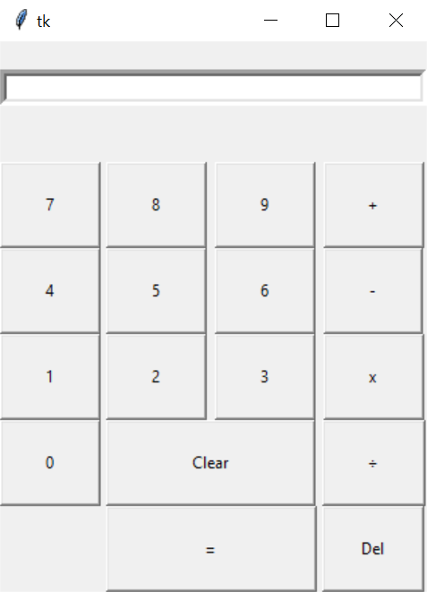

# Python - GUI Calculator

## Sections 
- [Description](#description)
- [Getting Started](#getting-started)
    - [Dependencies](#dependencies)
    - [Installing](#installing)
    - [Executing](#executing)
- [Author](#author)
- [License](#license)

---
## Description
This program is a simple 4 function GUI calculator made using the Tkinter Pyhton toolkit. 
There are two versions included in the source folder: 
"calculatorV2.py" evaluates the expression using the `eval()` function in Python. "calculator.py" uses individual functions for when it detects the respective operation being used.


<!--  -->


---
## Getting Started
<br />

### Dependencies
- Python 3.6.0+
- Mac/Windows OS

<br />

### Installing 
```bash
$ git clone https://github.com/JugalBili/Python-GUI-Calculator
```
Or you can download the zip directly from github. 

<br />

### Executing
To execute to programm, open the zip file into an IDE of your choice, or use the following in the termial: 
```bash
python calculatorV2.py
```
> **Make Sure** to run the command inside the folder

---
## Author 
**Jugal Bilimoria**
<br />July 29th 2020

<br />Project was made while learning the th ebasics of Python and Tkinter.

---
## License 


MIT License

Copyright (c) 2020 Jugal Bilimoria

Permission is hereby granted, free of charge, to any person obtaining a copy
of this software and associated documentation files (the "Software"), to deal
in the Software without restriction, including without limitation the rights
to use, copy, modify, merge, publish, distribute, sublicense, and/or sell
copies of the Software, and to permit persons to whom the Software is
furnished to do so, subject to the following conditions:

The above copyright notice and this permission notice shall be included in all
copies or substantial portions of the Software.

THE SOFTWARE IS PROVIDED "AS IS", WITHOUT WARRANTY OF ANY KIND, EXPRESS OR
IMPLIED, INCLUDING BUT NOT LIMITED TO THE WARRANTIES OF MERCHANTABILITY,
FITNESS FOR A PARTICULAR PURPOSE AND NONINFRINGEMENT. IN NO EVENT SHALL THE
AUTHORS OR COPYRIGHT HOLDERS BE LIABLE FOR ANY CLAIM, DAMAGES OR OTHER
LIABILITY, WHETHER IN AN ACTION OF CONTRACT, TORT OR OTHERWISE, ARISING FROM,
OUT OF OR IN CONNECTION WITH THE SOFTWARE OR THE USE OR OTHER DEALINGS IN THE
SOFTWARE.